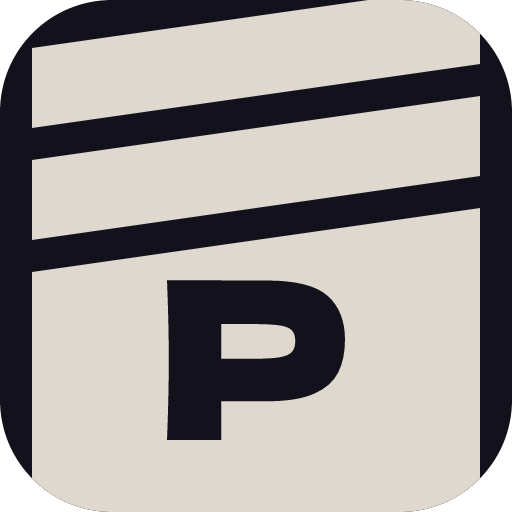

# icons/

Auto-generated web icon outputs. Do not edit these files manually —
edit `resources/icon.svg` and re-run `npm run gen:icons`.

| File | Purpose | Preview |
|---|---|---|
| `icon-512.png` | Play Store listing icon (512×512). Upload this to the Play Console. |  |
| `feature-graphic.png` | Play Store feature graphic (1024×500). Upload this to the Play Console. |  |
| `icon-*.webp` | PWA manifest icons, referenced by `public/manifest.webmanifest`. See below. |  |

## PWA manifest icons

When a user opens PassDrop in a mobile browser and chooses "Add to home screen", the
browser installs it as a Progressive Web App (PWA). The manifest icons are what the OS
uses for the home screen icon, app switcher, and splash screen in that scenario.

The browser picks the most appropriate size from the list based on the device's screen
density. Having multiple sizes ensures a sharp icon on every screen — from low-density
older devices to high-DPI modern ones.

This is separate from the native Android launcher icon (which comes from the mipmap
files in the Android project). The PWA icons are only used when running PassDrop as a
web app through the browser, not when installed via the Play Store.
