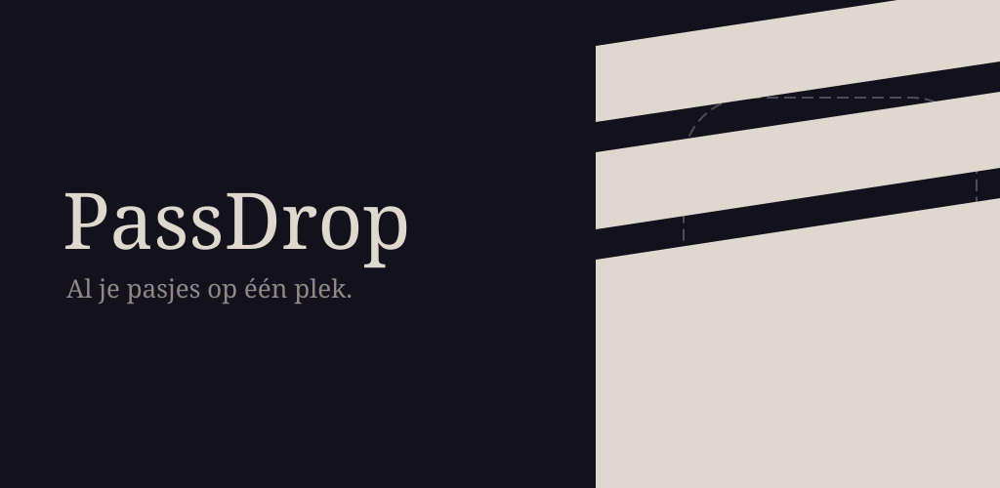

# resources/

Source files for the app icon and splash screen. These are the files you edit.
Everything else is generated from these — never edit generated files directly.

| File | Purpose | Preview |
|---|---|---|
| `icon.svg` | Master icon source (vector). Edit this to change the icon. |  |
| `icon-notification.svg` | Android status bar/notification icon source. Alpha-only silhouette (a rounded square with the "P" glyph knocked out) — Android discards colour and tints it. |  |
| `feature-graphic.svg` | Play Store feature graphic source (1024×500). Edit this to change the banner. The app icon is composited on top at render time — the dashed placeholder shows where it lands. |  |
| `DelaGothicOne-Regular.ttf` | Font used in `icon.svg`, `icon-notification.svg` and `feature-graphic.svg`, loaded locally by the generation scripts. | — |

## Regenerating icons

```bash
npm run gen:icons    # regenerates icons/, assets/, stamps Android mipmap files, and the notification icon
npm run gen:feature  # regenerates the Play Store feature graphic
npm run gen:preview  # serves icons/ at localhost:3333 for visual inspection
```